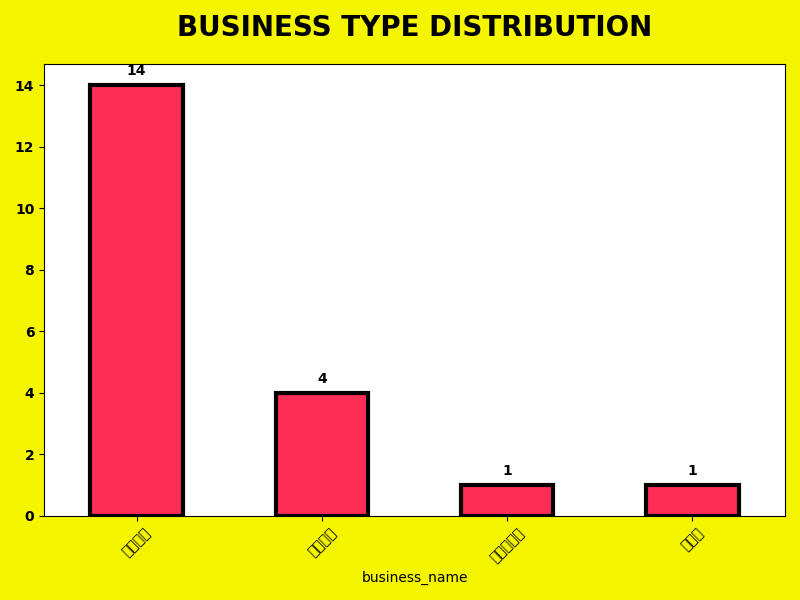
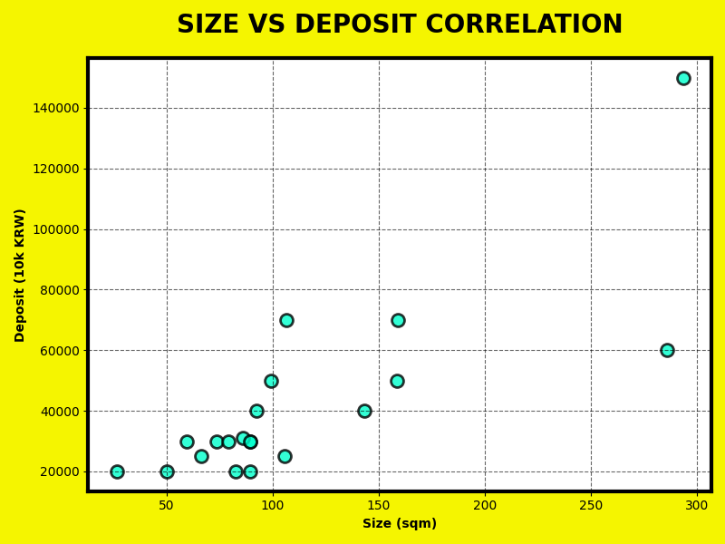

# 🏢 REAL ESTATE REPORT
### Nemo Professional Data Analytics

---

## 📈 DATA OVERVIEW
### 강남역 인근 실시간 매물 20건 분석

- **총 매물 수**: 20건
- **평균 보증금**: 약 42,050만 원
- **평균 월세**: 약 338만 원
- **평균 전용면적**: 약 111.8㎡
- **분석 지역**: 강남구 역삼동 일대

---

## 📊 BUSINESS TYPE
### 업종 분포 시각화

> **Insight**: 기타업종(사무실/스튜디오)이 70%로 압도적이며, 서비스업이 뒤를 잇고 있습니다.

---

## 📉 SIZE vs DEPOSIT
### 면적과 보증금의 상관관계

> **Insight**: 면적이 넓어질수록 보증금이 상승하는 정비례 관계를 보이나, 특정 대형 매물이 상위 가격대를 형성합니다.

---

## 🎯 TOP 5 PREMIUM ITEMS

| 매물 명칭 | 업종 | 보증금 | 월세 | 면적(㎡) |
| :--- | :--- | :---: | :---: | :---: |
| 역삼동 고급주택 | 기타업종 | 15억 | 1,000만 | 293.6 |
| 아정당부동산 | 음식점 | 7억 | 700만 | 106.7 |
| 스튜디오 작업실 | 기타업종 | 3억 | 160만 | 59.5 |
| 신축 루프탑 | 서비스업 | 2억 | 250만 | 50.0 |
| 의류사무실 | 서비스업 | 3억 | 250만 | 89.3 |

---

## 🔍 DETAILED INSIGHTS

1. **상권 성격**: 강남역 핵심 상권은 음식점보다 **고부가가치 오피스 및 스튜디오** 수요가 높음.
2. **임대 시세**: 평균 보증금이 4억을 상회하며, 특히 **대형 사옥형 매물**의 경우 15억 이상의 높은 진입 장벽 존재.
3. **공간 효율**: 100㎡ 내외의 중형 매물이 가장 활발하게 거래되는 평형대임.

---

# THANK YOU!
### ANALYTICS COMPLETED

<footer>NEO-BRUTALISM · REAL-TIME DATA · 2026-04-29</footer>
